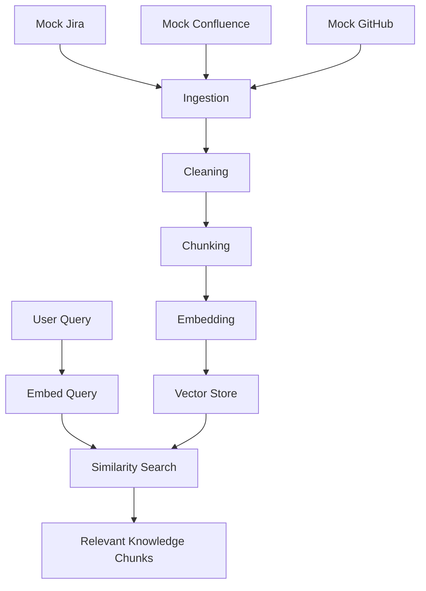

# 🧠 AI Test Case Generator (RAG) — Phase 1 & 2

This project is a **production-grade, modular, Retrieval-Augmented Generation (RAG)** system built using **Next.js + TypeScript** to automatically generate **test cases from Jira, Confluence, and GitHub** data.

### Currently Implemented:
- ✅ Mock data ingestion (Jira, Confluence, GitHub)
- ✅ Unified document layer
- ✅ Preprocessing & cleaning
- ✅ Token-aware chunking
- ✅ OpenAI embeddings (`text-embedding-3-large`)
- ✅ Local vector database
- ✅ Semantic retrieval (RAG foundation)

---

## 🎯 Vision

The goal of this system is to:

> Automatically understand **requirements (Jira)**, **design (Confluence)**, and **code (GitHub)** and generate **accurate, grounded, and consistent test cases** using LLMs.

This is **not a toy chatbot**. It is a **real RAG-based engineering system**.

---

## 🏗️ Architecture (Current)



*(Text-based representation)*
```
Mock Jira ─┐  
Mock Conf ─┼─> Ingestion ─> Cleaning ─> Chunking ─> Embedding ─> Vector Store  
Mock Git ──┘                                                    ↑  
                                                                |  
User Query ──────────────> Embed Query ───────────────> Similarity Search  
                                                                |  
                                                                v  
                                                      Relevant Knowledge Chunks  
```

---

## 📁 Project Structure

```bash
src/
├── app/                  # Next.js UI
├── core/
│   ├── ingestion/        # Jira/Confluence/GitHub loaders (mock)
│   ├── preprocessing/    # Cleaning & normalization
│   ├── chunking/         # Chunk splitting
│   ├── tokenization/     # Token counting
│   ├── embedding/        # OpenAI embedding service
│   ├── vectordb/         # Local vector store
│   ├── orchestrator/     # RAG pipeline coordinator
│   └── types.ts          # Domain contracts
│
└── mockdata/
    ├── jira.json
    ├── confluence.json
    └── github.json
```

---

## 🔄 Data Flow

1. **Ingest**: Load mock Jira, Confluence, and GitHub data.
2. **Normalize**: Convert everything into a uniform `UnifiedDocument` structure.
3. **Clean**: text processing and normalization.
4. **Chunk**: Split content into manageable pieces.
5. **Token Count**: Calculate tokens for context window management.
6. **Embed**: Generate embeddings using OpenAI (`text-embedding-3-large`).
7. **Store**: persistent in local vector store.
8. **Retrieve**:
   - Embed user query.
   - Run cosine similarity search.
   - Return most relevant chunks.

---

## 🧠 Key Concepts Implemented

- **RAG Foundation**: Retrieval Augmented Generation architecture.
- **Semantic Search**: Using vector embeddings for meaning-based lookups.
- **Token-aware Chunking**: optimizing for LLM context limits.
- **Enterprise Architecture**: Separation of concerns and modular design.
- **Unified Knowledge Layer**: Source-agnostic document handling.

---

## 🔑 Environment Setup

1. Create a `.env.local` file in the root directory (or `.env`).
2. Add your OpenAI API Key:

```bash
OPENAI_API_KEY=sk-xxxxxxxxxxxxxxxxxxxx
```

---

## ▶️ How to Run

1. **Install Dependencies**:
   ```bash
   npm install
   ```

2. **Run Development Server**:
   ```bash
   npm run dev
   ```

3. **Open Application**:
   Navigate to [http://localhost:3000](http://localhost:3000).

   You should see retrieved chunks for a test query like:
   > "login password rules"

---

## 🧪 Status

The following core components are currently verified and operational:
- [x] Ingestion
- [x] Chunking
- [x] Embedding
- [x] Vector Search
- [x] Retrieval Quality
